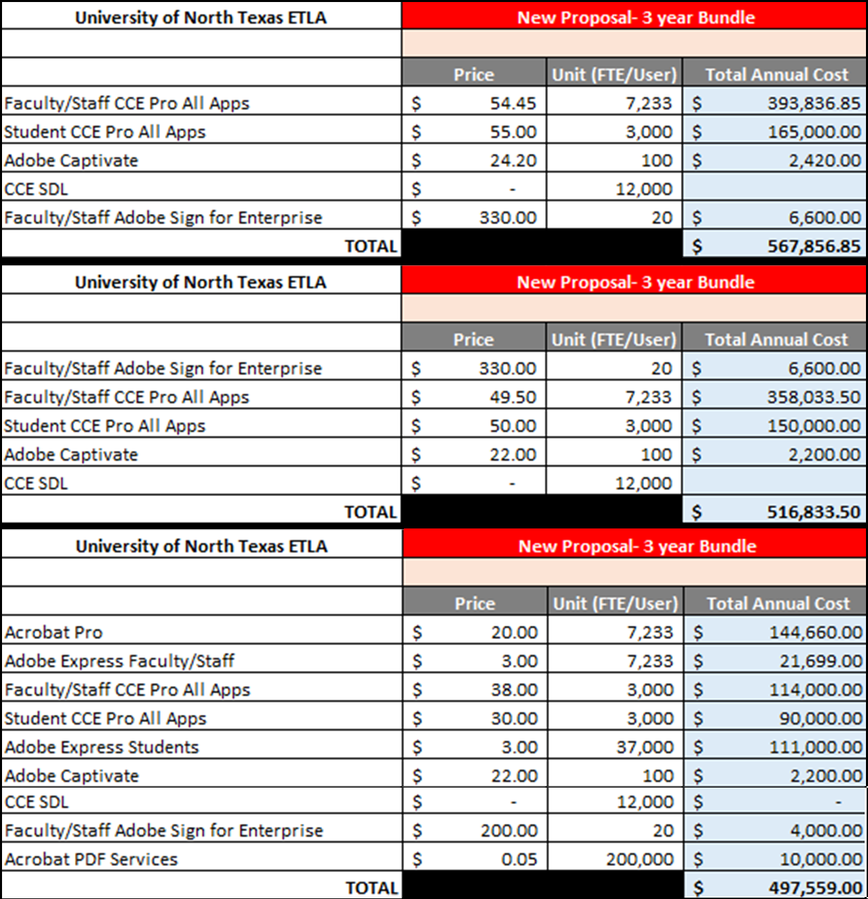
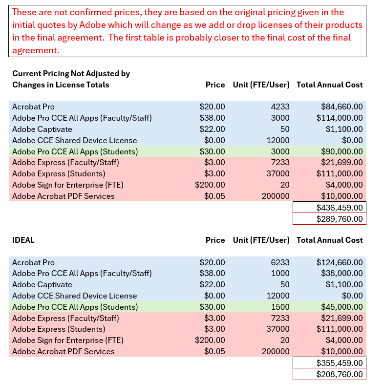

+++
title = "Adobe FY24 Contracts Renwal"
description = ""
outputs = ["Reveal"]
ack = "Michael Baggett; College of Visual Arts and Design: April, 2024"
[logo]
src = "adobe.svg"
alt = "" # Alt text. 
width = "3%" # Size of the file.
diag = "1%" # How far from the top right should the file be.
top = "4%" # Overrides diag.
left = "1%" # Overrides diag.
background = "#fff"
padding = ".25rem"
[reveal_hugo]
custom_theme = "reveal-hugo/themes/imageless.css"
[fullscreenToggle]
+++
# Adobe 
## Contracts Renewal Discussion: FY24

### Brief History

The **UNT System** has long had an educational enterprise agreement with **Adobe** that provides a full **Adobe Creative Cloud** subscription (**termed: Named User License**) for each full-time employee and *instructor of record* (this includes adjuncts and graduate students who are teaching courses).  

The agreement also allows for the installation of a limited version of the Adobe Creative Cloud suite of applications, which does not provide some apps or cloud services (termed: Shared Device License), to be installed on devices available exclusively on-premise (cannot leave campus or be accessed remotely) that can be used by anyone with an institutional account or an Adobe ID (available free-of-charge) including students, part-time employees, and even visitors (**termed: Shared Device License)**. They are provided at no addtional cost to the institution. The caveat is that these licenses are only assignable to devices that are *shared* meaning they cannot be installed on personally assigned devices.  This is what we install in classrooms, labs libraries, and for student workers and part-time employees in business units. 

Educational Adobe license use is fairly unrestricted under an educational enterprise agreement.  They can be used for anything related to the organizations activity.  

---
## COVID

During the COVID pandemic, when campuses across the country were closed, Adobe granted free *full* subscriptions, same as the FTE subscriptions we have through the UNT System agreement, to all students enrolled in classes at instutions with an educational enterprise agreemnent in place.  These were revoked once campuses re-opened.  

Using **Higher Education Emergency Relief Funds (HEERF)** to pay for much of the first year of the agreement, the **Office of the Provost** agreed to fund a thee-year agreement to provide full subscriptions to students *at a greatly reduced cost*.  The UNT System collaborated on the contract, but this agreement is separate from the UNT System agreement and is managed separately. The contract renewals have been paid for on student fees exclusively for the remaining two years of the agreement.  The subscriptions through this agreement have been sold directly to students and departments.  The program is managed by the **College of Visual Arts and Design** IT staff. All accounting is maintained by the **Office of the Provost**.  This agreement did not include the Dallas or Health Science Center campuses.

The cost in years two and three of the agreement was $50 per subscription, with a minimum of 3000 subscriptions to be purchased: $150,000.  When selling a subscription we added the e-commerce processing fees to the price to the student: $5.55 under Kivuto (year one and two), and $3 under Quik-Pay (year three).

The goal of the program was to generate enough revenue through the sale of the subscriptions to cover the contract renewal in the following year.

---
## Outcome of the Three-Year Agreement

The first year was a wash.  We began negotiations after we received the authorization from the System and Campus in May 2021. The contract did not go into effect until November, the day before the Thanksgiving Break. By that time most students had already bought a full cost subscription through Adobe - which have a minimum length of twelve months.

In years two and three things have gotten better but we still have not been able to sell much beyond 1500 subscriptions in either year.  We did work with the UBSC (University Brand Strategy and Communications) to advertise to students but a better strategy is needed. UNT, specifically the **Office of the Provost** has supplemented the contract renewal costs with additional funding in both years.  ***This issue is discussed further on the slides covering the pricing under a new agreement***.

**The agreement resulted in a significant savings for our students**.  The total price of $55.55 (maximum) annually to the students resulted in a savings of 77-85% over the standard Adobe Educational price.

- Students without an existing student subscription through Adobe saved 77%: The Adobe price is $19.99 per month for the first 12 months; total cost would have been $239.99 for the year.
- Students with an existing student subscription were allowed to opt-out through a stipulation in our agreement. The students renewing their student subscriptions through Adobe saved 85%: The Adobe price is $29.99 per month after the first year; total cost would have been $359.99 for the year.

UNT students saved a combined $276,000 to $457,320 annually during years two and three of the agreement. 

---
## UNT System Contract Renewal Negotiations

The UNT System agreement was due to expire on June 1st.  Ours expires on August 1st.  The UNT System has extended their agreement to August 1st so that we can negotiate better terms across the system by having a single contract. This will reduce our cost for Adobe significantly in and of itself: As you will see on a later slide the initial renewal quote we received from Adobe was lower than the combined costs of the previous agreements.  Those two agreements did not even cover all of our Adobe licensing due to some gaps in the terms.  The new agreement will close those gaps.

The Adobe contracts cover multiple products, all of the products below are **Named User Licenses**, the *Shared Device Licenses* are a free add-on to an enterprise agreement.

- Acrobat Pro
- Adobe Pro Creative Cloud Enterprise (Named User Licenses)
- Adobe Express
- Adobe Sign for Enterprise (FTE Only)
- Adobe Acrobat PDF Services.

How many licenses of each product we opt-in for will affect the total cost.  

---
## Adobe Product Descriptions

- **Acrobat Pro**: 
This is the only Adobe product that we know for certain every user, employee and student, will use.  It is part of the Adobe Creative Cloud and Adobe Creative Cloud Pro.     
- **Adobe Pro Creative Cloud Enterprise (Named User Licenses)**:
The current UNT System agreement provides a full subscription to all FTEs for all Adobe Creative Cloud Pro apps.  The UNT System is looking at whether we should continue to license this for everyone across the board. An initial quote was provided by Adobe that covered a scenario where we did not license it for all FTEs as we have done in the past. 
- **Adobe Express**:
This is a very inexpensive content creation tool that would be useful to those who do not need the full Adobe Creative Cloud subsciption but did need the ability to do basic edit imaging and such. It also allows users to design and push content directly to their social media channels.
- **Adobe Sign for Enterprise (FTE Only)**: 
This is a cloud-based e-signature service that allows the user to send, sign, track, and manage signature processes using a browser or mobile device.
- **Adobe Acrobat PDF Services**:
This is an enterprise service that allows for standardization of PDFs and increased fucntionality for PDFs in websites and applications.  Particulary useful for maintaining accesibilty standards for an institution.
-- **Adobe Captivate**: This is an authoring tool that is used for creating course and eLearning content. It is only used by a small number of users but is licensed through the UNT System agreement.  The cost for this application, based on known usage, is negligible.

Our current agreement allows for 12,000 **Shared Devices Licenses**, at no cost.  That is based on the number of FTEs we purchase an **Adobe Creative Cloud Pro** subscription for. If we license fewer int he new contract this wil go down.  But we currently only use less than 1600 across the UNT System so this should not be an issue.

---
## Goals and Challenges

- **Goal**: License Adobe products that are in line with actual usage.  Adobe bases their pricing on percent of an institutions total users licensed.  It is difficult to track usage across an organization.  Adobe will not provide the data we need to this, so we only have the number of activate subscriptions to go on.  The usage data we did receive from Adobe on student subscriptions where demonstrably wrong, over infalted greatly.  At the time we spoke they claimed we had 1600 students who had purchased a subscription when we had just over 1000 (confirmed through our admin console). They had no explanation for the error when it was pointed out.

- **Goal**: Combine our two populations of users, employees and students, into a single pool for cost calculations and to further avoid over spending.  That was an option for agreements when I was negotiating with Adobe three years ago.  The boilerplate agreement we were provided with at the start did not separate the two populations.  It is only that a separate agreement already existed for FTEs that added restrictions on whom we could grant licenses to under our agreement. But with Adobe it is never that simple.  What is best for us, is rarely the direction Adobe will allow us to go.  The initial quotes from Adobe have the two populations separate.  Combining the two populations was proposed to Adobe 

- **Goal**: Only license the products available from Adobe initially that we are able as an institution to utilize.  We can always add services later but should avoid licensing anything at the start we cannot immmediately put in use.

---
## Negotiations with Adobe

On the UNT System side there has been complete turnover on the staff involved in the negotiations since the last UNT System renewal and our own initial contract negotiations. The new team is clearly motivated to agressively negotiate with Adobe.  Particularly in regards to the first goal.  At our first meeting last year over licensing the full **Adobe Creative Cloud** subscriptions was identified as something to address in the new contract.  That is reflected in the initial quotes we received from Adobe. 

Everyone seems to be on the same page.  

If we set the numbers too low, that is not really a problem: at the end of each year of the agreement there is a reup calculation and we would have to pay for any licenses not paid for at the beginning of the year.  But it would let us adjust for actual license use for the first time in a long while.

&nbsp;

&nbsp;

&nbsp;

## **Now the numbers...** ##

---
## Initial Quotes

Initial Quotes from Adobe

Worksheet
 

---
## UNT Campus Expenditure

Focusing only on the UNT Campus part of the agreement: We are looking at a possible drop in price per subscription of $20.  The numbers could change though as the new price is based on certain assumptions by Adobe on what the UNT System will license as a whole.  But it will undoubtedly go down from the current cost of $50 per subscription.

- Adobe Express for Students would not be a UNT Campus expense.  

- If the other campuses buy-in on student subscriptions this time around, the whole thing could become a UNT System expense.  I am assuming at this point it would still remain a non-UNT System expense.

Assuming it does remain a UNT expense, to make the student subscription program sustainable and meet the original goal of being net $0 expense for the institution I propose we leave the price at $50 when we sell the subscriptions to students and departments *unless we are able to reduce the number of licenses we are required to buy at the start to 1500*. 

Adobe calculates the minimum as 10% of the total student population.  They are using 37,000 as our total student population, which is low.  During the negotiations a year ago the starting number or required licenses was 4000.  They agreed to lower it for the first contract but said it would go up in the renewal.  That has not been mentioned so far.    

- We know we can sell 1500 per year. But if we have to buy 3000, unless we are able to better market this offer to students there will be a shortfall.
- The cost to buy the initial 3000 is $90,000.  If we sold 1500 subscriptions at $50, we would generate $75,000 which is much closer to covering our costs than $45,000, which is what we would generate by selling subscriptions at cost to the students. 1800 subscriptions would be the break even number.

---
## Proposed Changes 

In order to sell the maximum number of subscriptions possible we need:

- Information on which courses being taught on-campus use or make Adobe Creative Cloud applications an option in their curriculum.
- Information from Distance Learning on which online courses use or make Adobe Creative Cloud applications an option in their curriculum.

We should require the offer be included in the syllabi for these courses.

&nbsp;

### The entire program should be managed by the System, coordinating with the UNT Helpdesk.

There are too many pieces to the program, most are under the UNT System's control.  It is not efficient to maintain a program under these conditions.

