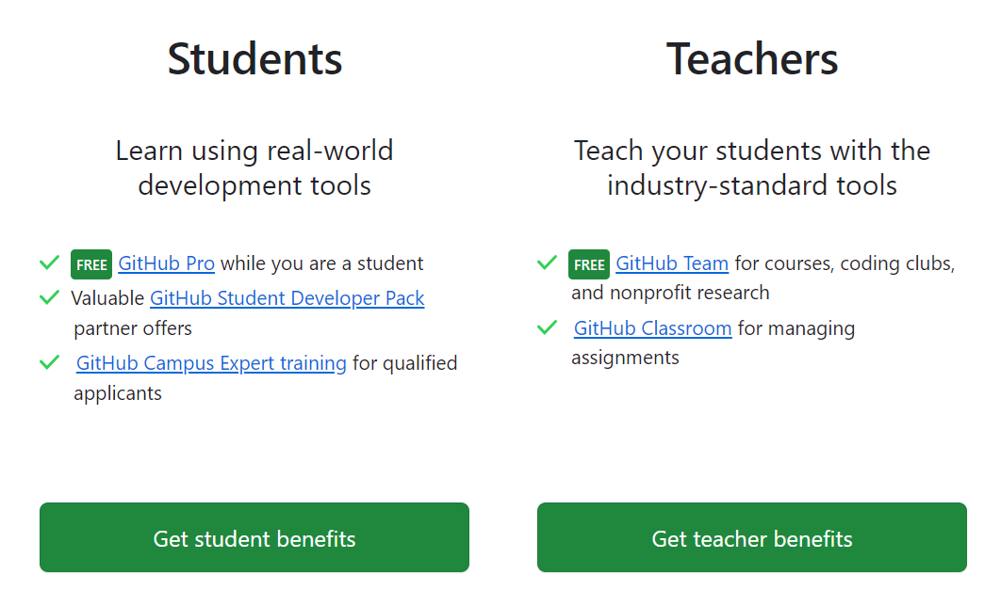

+++
title = "What is GitHub?"
description = "Introducing GitHub"
outputs = ["Reveal"]
[logo]
src = "github-mark-white.svg"
alt = "" # Alt text. 
width = "3%" # Size of the file.
diag = "1%" # How far from the top right should the file be.
top = "2%" # Overrides diag.
left = "1%" # Overrides diag.
[reveal_hugo]
custom_theme = "reveal-hugo/themes/imageless.css"
+++

# What is GitHub?

[Git](https://git-scm.com/ 'Git Website') is a distributed version control system, designed to handle everything from small to very large projects with speed and efficiency. Created by Linus Torvalds in 2005, Git has become the most widely used version control system in the world and is widely used for collaborative software development.  But it has wider uses.  As examples it is used by writers and artists to track changes as it keeps a complete history of changes and changes can be rolled back to any point.  You can grant access to your projects and allow others to submit changes: those changes can be reviewed by the owner and merged, rejected, or a separate branch maintained.

[GitHub](https://www.github.com 'GitHub Website') is a web-based platform built on top of Git. It provides a user-friendly interface and additional tools to make collaborating on code easy and efficient, allowing multiple developers to work together on projects without overwriting each other's changes. Launched in 2008, GitHub not only hosts repositories but also offers features like issue tracking, code reviews, and integrations with various tools and services, making it a hub for open-source projects as well as private enterprise development.

GitHub is available in both [free and paid versions](https://github.com/pricing 'Pricing for Github').  All users can create *organizations* under their accounts.  There are also free upgrades available for [educational users](https://education.github.com/benefits 'GitHub Educatinl Offers').

> Students can upgrade their accounts to [**GitHub Pro**](https://docs.GitHub.com/en/GitHub/getting-started-with-GitHub/GitHubs-products#GitHub-pro) free of charge, while they are enrolled as a student, and are eligible to receive the [GitHub Student Developer Pack](https://education.GitHub.com/pack).  

> Instructors can upgrade their accounts to [**GitHub Team**](https://GitHub.com/team), which is basically a Pro version with the added benefit of upgrading your organizations to *Teams*, and access to [**GitHub Classrooms**](https://classroom.GitHub.com/), also all free of charge.

---

## Getting Started with GitHub

### GitHub Basics

[GitHub Features](https://github.com/features 'Link to Features page on GitHub') 
[GitHub Documentation](https://docs.github.com/en 'Link to Documentation page on GitHub')
[GitHub Skills](https://skills.github.com/ 'Link to Interactive Learning Courses')
[GitHub Actions](https://github.com/features/actions 'Link to GitHub Actions information')
[GitHub Pages](https://pages.github.com 'Link to GitHub Pages: host your own website for free on GitHub') 

[GitHub Dev](https://github.dev/ 'Link to GitHub Dev') 
[GitHub Codespaces](https://github.com/features/codespaces 'Link to GitHub Codepsaces') 
[GitHub Security](https://github.com/features/security 'Link to GitHub Security')
[GitHub Copilot](https://github.com/features/copilot 'Link to GitHub Copilot')
[GitHub Code Review](https://github.com/features/code-review 'Link to GitHub Code Review')

### GitHub Education Benefits

- [GitHub Student Developer Webpack](https://education.GitHub.com/pack, 'GitHub Student Developer Webpack') Students
- [GitHub Campus Expert Training](https://education.GitHub.com/students/experts, 'GitHub Campus Expert Training') Students
- [GitHub Campus Expert Training](https://education.GitHub.com/students/experts, 'GitHub Campus Expert Training') Students
- [GitHub Teams](https://GitHub.com/pricing, 'GitHub Teams') Instructors
- [GitHub Classroom](https://classroom.GitHub.com/, 'GitHub Classrom') Instructors

> The [Student Developer Pack](https://education.GitHub.com/pack 'GitHub Student Pack') provides free access to tools ands services that would otherwise be quite costly to a student. You are strongly encouraged to take advantage of this offer.

---
&nbsp;
&nbsp;
&nbsp;
&nbsp;
&nbsp;
&nbsp;
&nbsp;

## Learning GitHub 

### Microsoft Learning Paths

* [GitHub Foundatons Learning Path](https://learn.microsoft.com/en-us/users/GitHubtraining/collections/o1njfe825p602p)
* [GitHub Actions Learning Path](https://docs.microsoft.com/en-us/users/GitHubtraining/collections/n5p4a5z7keznp5)
* [GitHub Advanced Security Learning Path](https://docs.microsoft.com/en-us/users/GitHubtraining/collections/rqymc6yw8q5rey)
* [GitHub Copilot Fundamentals](https://learn.microsoft.com/en-us/training/paths/copilot/)
* [Get started with GitHub and Visual Studio Code](https://learn.microsoft.com/en-us/training/paths/get-started-github-and-visual-studio-code/)

> [LinkedIn Learning](https://technology.untsystem.edu/divisions/mrs/it-training/linkedin-learning.php) also provides several courses on learning Github, including a [Career Essentials Certificate](https://www.linkedin.com/learning/paths/career-essentials-in-github-professional-certificate). As a student at UNT, you have [free access](https://technology.untsystem.edu/divisions/mrs/it-training/linkedin-learning.php) to LinkedIn Learning.

---

## Creating A GitHub Account

It is quite simple to create a GitHub account.  Start by going to the [GitHub Homepage](https://github.com/) and click one of the **Sign up** buttons on the page and follow the directions to create your account.

After you have an account, go the [educational benefits page](https://education.github.com/benefits) and signup for your free offers.

---
&nbsp;
&nbsp;
&nbsp;
&nbsp;

&nbsp;
&nbsp;
&nbsp;
&nbsp;

&nbsp;
&nbsp;
&nbsp;
&nbsp;

&nbsp;
&nbsp;
&nbsp;
&nbsp;

&nbsp;
&nbsp;
&nbsp;
&nbsp;

&nbsp;
&nbsp;
&nbsp;
&nbsp;

# END
